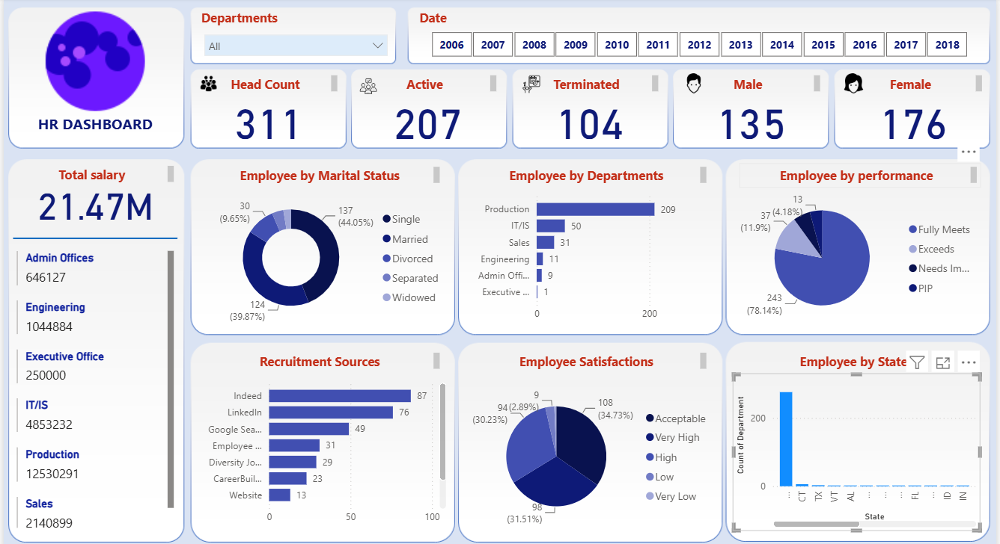

# 📊 HR Analytics & Workforce Insights Dashboard

An interactive HR Analytics Dashboard built using Microsoft Power BI to transform employee data into meaningful workforce insights.

## 📷 Dashboard Preview

## 📌 Project Overview

This project focuses on analyzing employee data and presenting key HR metrics through an interactive Power BI dashboard.

The dashboard provides insights into workforce composition, salary, departments, employee performance, recruitment sources, employee satisfaction, and geographic distribution.

## 📊 Key KPIs

- Total Head Count
- Active Employees
- Terminated Employees
- Male Employees
- Female Employees
- Total Salary

## 🔎 Dashboard Analysis

The dashboard includes analysis of:

- Employee by Marital Status
- Employee by Department
- Employee Performance
- Recruitment Sources
- Employee Satisfaction
- Employee Distribution by State
- Department-wise Salary

## 🎛️ Interactive Filters

Users can interact with the dashboard using:

- Department filter
- Year filter

These filters dynamically update the dashboard visuals and KPIs.

## 🛠️ Tools & Technologies

- Microsoft Power BI
- Data Analysis
- Data Visualization
- Business Intelligence
- Interactive Dashboard Development
- HR Analytics

## 🎯 Project Objective

The main objective of this project was to transform raw HR data into an interactive and easy-to-understand dashboard that can help organizations analyze workforce trends and make data-driven decisions.

## 💡 Key Insights

The dashboard helps analyze:

- Overall workforce size and employee status
- Department-wise employee distribution
- Gender and marital status distribution
- Employee performance levels
- Recruitment source effectiveness
- Employee satisfaction
- Salary distribution across departments
- Geographic distribution of employees

## 🎥 Project Demo

[▶️ Watch Dashboard Demo](./demo/HR_Dashboard_Demo.mp4)

## 📁 Project Files

- `HR_Analytics_Dashboard.pbix` — Power BI dashboard file
- `HR_Analytics_Dashboard.png` — Dashboard preview
- `demo/HR_Dashboard_Demo.mp4` — Dashboard screen recording

## 👨‍💻 Project

This project demonstrates my skills in data analysis, data visualization, dashboard development, and business intelligence using Microsoft Power BI.
